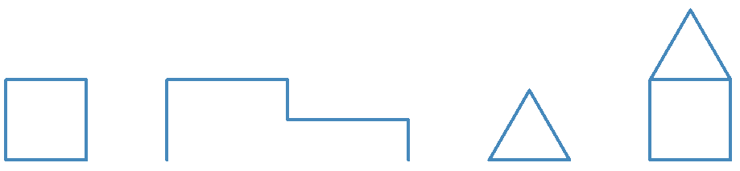

# Introducción a Python

 <!-- .element style="margin-left: auto; margin-right: auto; display: block" -->


---


# Tenemos un plan

 <!-- .element class="medium right" -->

### Parte I: programación
- Python básico
- Algoritmos
- Proyecto final: juego
- Proyecto extra: bot de Telegram

### Parte II: Inteligencia Artificial
- Introducción a la IA
- Modelos con Tensorflow / Pytorch
- Proyecto final: reconocimiento de fotografías


---


### La programación son cinco cosas

1. Secuencia
2. Condicionales
3. Repetición
4. Variables
5. Funciones


---

# ¡A pintá!


 <!-- .element class="big center" -->

---

[https://pythonandturtle.com/turtle](https://pythonandturtle.com/turtle)

### Estructura básica de código


```python [0|1-2|4-14|16]
# Turtle script example
t = turtle.Turtle('turtle')

t.width(1)
t.speed (1)
t.color('red')

t.forward(50)

for i in range(4):
  t.forward(100)
  t.left(90)

t.backward(50)

turtle.done()
```

- Inicialización (siempre igual)
- Hacer cosas
- Terminar (siempre igual)


---

### Mover la tortuga

- Velocidad

```python
t.speed(1) # 1 lento, 500 rápido
```

- Avanzar / Retroceder:

```python
t.forward(50)
t.backward(50)

t.forward(-50)
t.backward(-50)
```

- Girar. En º y admite negativos:


```python
t.left(90)
t.right(45)
```

- Control del lápiz

```python
t.penup()
t.pendown()
t.color('red')
```

---

# Pues a pintá

[https://pythonandturtle.com/turtle](https://pythonandturtle.com/turtle)
<!-- .element class="centered" style="margin-top: -3rem;" -->

**OJO**: las mayúsculas/minúsculas son importantes
<!-- .element class="centered" -->

**OJO**: la alineación del código es importante
<!-- .element class="centered" -->

 <!-- .element class="noborder center" -->

- *Extra*: Dibuja un triángulo isósceles
- *Super extra*: Dibuja un triángulo isósceles... y no lo hagas "a ojo"

Note:
- Ejemplo: cuadrado
https://docs.python.org/3/library/turtle.html#turtle-graphics-reference

---

# Repeticiones

```python[0|1-2|5-8|5|6-8|10-11]
# Hago cosas antes
t.forward(100)

# Repito tres veces
for num_vuelta in range(3):
    # Esto es lo que se repite, ojo a la identación
    t.forward(100)
    t.left(90)

# Luego puedo hacer más cosas
t.forward(100)
```
<!-- .element style="font-size: 0.8em" -->

- Se pueden hacer cosas antes
- La alineación nos dice lo que va "dentro" del `for``
- Luego, el programa continuará

---

# A pintá

[https://pythonandturtle.com/turtle](https://pythonandturtle.com/turtle)
<!-- .element class="centered" style="margin-top: -3rem;" -->


 <!-- .element class="noborder center" -->

---

# Expresiones y variables
## TODO
